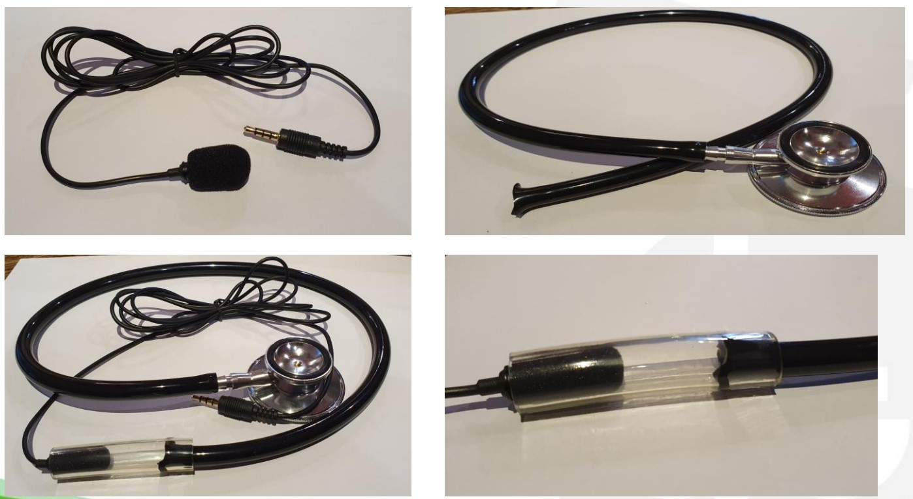
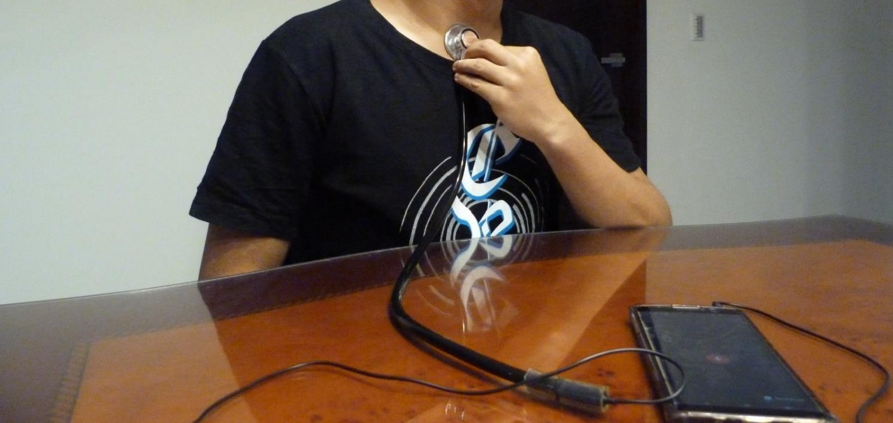
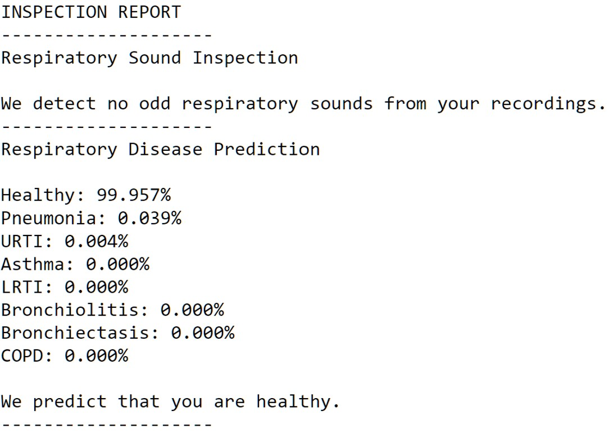

# Respiratory Disease Inspection Platform 

A residual neural network for potential disease checks, using respiratory sounds recorded by microphoned stethoscopes.

## Usage

1. Record your respiratory sounds by handcrafted recorders.
   
   
2. Name the files from `1.wav` to `7.wav` according to the corresponding positions.
   
3. Run `Lung_Sound_Inspection.py` in the `server` directory to get the results.
   